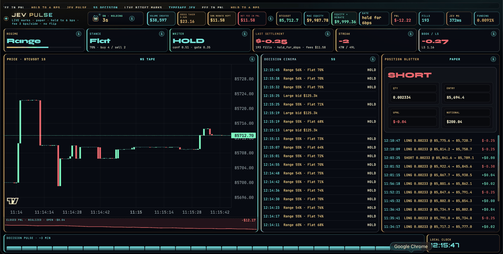
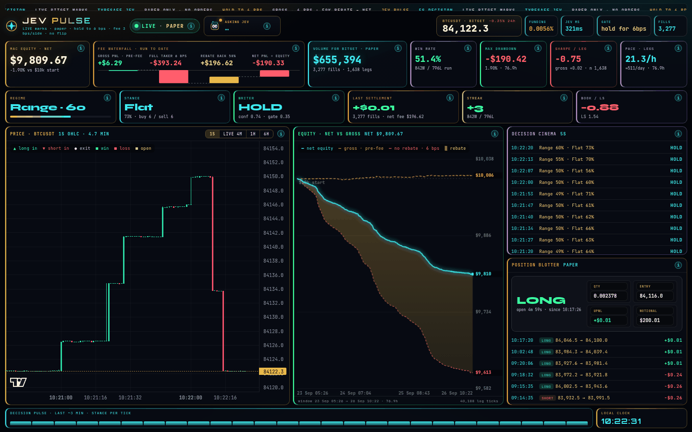
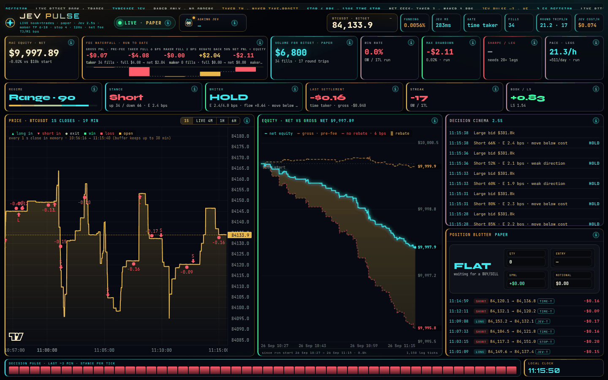

# Jev Pulse

**Bitget AI Base Camp Hackathon S2** · Agentic Trading · **Open Theme (Custom)**

BTCUSDT perpetual paper desk on live Bitget public data. TypeSafe Jev (`typesafe/jev-1.13`, OpenRouter Decisions API) makes the trading decisions. A local executor only lets a decision pay a fee when the numbers say it can.

Paper only. No order is ever sent to Bitget.

Repo: [github.com/CryptoCT01/jev-pulse](https://github.com/CryptoCT01/jev-pulse)

Second independent S2 entry. Not Crossfire.

## Latest update: v3 (26 Sep 2026)

We have made another update. The testing we did on the previous version showed that it was not viable to continue with it, so the desk now runs a new high-frequency strategy (v3) with a new dashboard. The next two sections explain what we tested, what we found, what changed, and how the dashboard has improved from the original to today.

## Why we changed the strategy

### What we tested

The original desk (v1) asked Jev for a side every few seconds, traded one $200 clip with a taker order, and held until the mark had moved 6 bps for or against the position. It ran as a fee-aware paper book from 23 to 26 Sep 2026 (run 1).

- Run 1 finished at **−$190.35 net** on about **$655k** of paper volume.
- Before fees it made **+$6.03**. Fees were **$196.38**.
- The fee model is **3 bps per side**: Bitget's 6 bps USDT-M taker fee, less the 50% rebate on this account. That makes **6 bps per round trip**.

We then replayed run 1 through **66,960 variants** of the same approach: take-profit and stop sizes, trailing exits, time stops, maker or taker entries and exits, long-only and short-only, cooldowns and signal filters. The first 60% of the data was in-sample and the last 40% out-of-sample. **None of the variants was profitable out-of-sample.** The best out-of-sample result of all of them was −$0.57. The best variant that kept the trade frequency (at least 70% of the original fills) was −$34.35.

### What we found

- Jev's direction calls had a real but tiny edge before fees: about **0.2 bps per round trip**, against a **6 bps** round-trip cost. No exit rule closes a gap that size.
- Maker (post-only) entries made it worse because of adverse selection: the orders that filled tended to be the ones the market then moved against. Only a maker take-profit helped, and only slightly.
- The previous approach was therefore not viable to continue. We stopped run 1 at 10:27 UTC on 26 Sep and archived its logs.

The replay code and results are in [research/replay/](research/replay/).

### What v3 does differently

- **Still high-frequency, but only enters when the expected move clears the fees.** Jev is asked every 2.5 s. When flat it gives a direction and an expected move. The entry threshold starts at 4 bps (3 bps taker entry + 1 bps maker exit) and adapts between 4 and 9 bps with the trade rate. It never accepts an expected move below cost.
- **Maker take-profits to cut costs.** Profits are taken with a post-only order 6 to 10 bps away, which costs 1 bps net instead of 3.
- **Order-flow and order-book inputs.** The engine reads Bitget's public WebSocket (top-15 book, every public trade, ticker). A book and flow score has to agree with Jev's side before a trade is opened.
- **Jev close-now exits.** Once a trade is open, Jev is asked a different question: "close now?". A score of 0.70 or more closes the trade. A 4 bps taker stop and a 120 s time stop cap the risk.
- The paper account was reset to **$10,000** for v3 so it can be judged on its own.

Full rules: [STRATEGY-v3.md](STRATEGY-v3.md). Parameters: [scripts/hf_params.json](scripts/hf_params.json).

### v3 so far (early, in progress)

Live since 10:27:39 UTC on 26 Sep 2026. Snapshot at **11:15:40 UTC** the same day, in a very quiet market:

| Metric | Value |
| --- | --- |
| Round trips | 17 (0 wins, 17 losses) |
| Paper volume | $6,800 (34 taker fills, 0 maker fills) |
| Gross before fees | −$0.07 |
| Fees after rebate | $2.04 |
| Net PnL | **−$2.11** (equity $9,997.89) |
| Exits | 9 time stop · 7 Jev close-now · 1 stop · 0 take-profit |
| Jev | about 280 ms median latency · $0.057 of model calls so far |

This is less than an hour of data, and v3 is not profitable. No take-profit has filled yet, so every exit so far has paid the taker fee. Most flat decisions end with no trade because Jev's expected move is below the cost threshold. With a 6 bps maker take-profit and a 4 bps stop, the book needs roughly 83% of its take-profit-or-stop exits to be take-profits to break even, so we are not claiming an edge. Flat is still the benchmark. We will keep it running and update these numbers.

## Dashboard timeline

Each screenshot shows real paper data from the engine and its logs, in the order the dashboard was built. Times are UTC.

### 1. v1 · the original desk (24 Sep 2026)



The starting point, early in run 1 (193 fills, −$12.22): live 1 s candles, Jev's decisions and a row of fee tiles. Its "Equity + rebate" tile counted the rebate twice; v2 fixed that.

### 2. v2 · fee waterfall and equity curve (26 Sep 2026, 10:22 UTC)



Adds a fee waterfall (gross, full taker fee, rebate, net), a net-vs-gross equity curve with trade markers, win rate, drawdown, Sharpe, pace and a volume counter, then 1 s candles. It shows run 1 near its end: +$6.29 gross and −$190.33 net on $655,394 of volume.

### 3. v3 · the high-frequency desk (26 Sep 2026, 11:15 UTC)



Adds the maker/taker fee split, Jev close-now calls, a per-trade countdown, round-trip pace and a gold price line on every range (1H and 6H backfilled from Bitget public 1-minute klines). Captured from the live dashboard's data at 11:15:40 UTC: the first 48 minutes of v3, 17 round trips, −$2.11 net.

## Track 2 checklist · Agentic Trading

Only what Jev Pulse actually ships:

- [x] **Runnable demo**: local desk on `:8790`, live Bitget public data
- [x] **LLM as decision-maker**: TypeSafe Jev (`typesafe/jev-1.13`) via OpenRouter Decisions. Typed answers only (choice, noul, score): direction, expected move, risk stress, close-now. No prose thesis
- [x] **Event → decision → execution flow**: Bitget public book and trade stream → features every 2.5 s → Jev → cost and flow gate → paper fill or hold
- [x] **Risk control layer**: one $200 clip, flat-only entries, no same-tick flip, entry only above cost, 4 bps stop, 120 s time stop, risk-stress veto, spread and stale-book checks, same-side cooldown
- [x] **Paper trading (not live)**: honest paper fills on live data, no Bitget order path
- [x] **Paper trading log**: append-only JSONL. Run 1 evidence is committed in `logs/pre-fee/` and `logs/with-fee/`; v3 writes `logs/paper_ticks.jsonl` and `logs/paper_fills.jsonl` locally
- [x] **Compliant X post**: quote-tweet + desk demo [timeline](docs/X-POSTS.md) · https://x.com/CryptoCT01/status/2102053192871661870

## How v3 trades

| Step | Rule |
| --- | --- |
| Data | Bitget public WebSocket `books15`, `trade`, `ticker`; 5-min long/short ratio over REST |
| Decision | Jev every 2.5 s. Flat: direction, expected move, risk stress. In a trade: close-now, risk stress |
| Entry | Taker, one $200 clip. Needs P(side) ≥ 0.60, expected move ≥ threshold (4 to 9 bps), book/flow agreement, spread ≤ 1 bps, fresh book |
| Take-profit | Post-only maker, 6 to 10 bps (scaled with 120 s volatility) |
| Stop | 4 bps, taker |
| Time stop | 120 s, then a passive exit for 15 s, then taker |
| Jev close-now | ≥ 0.70 (position at least 8 s old): passive exit for 5 s, then taker |

Paper fills are deliberately strict: taker fills at the live touch, maker fills only when a public trade prints *through* the limit, and stops fill at the worse of the trigger print and the touch.

| Fee per fill | Full | After 50% rebate |
| --- | --- | --- |
| Taker | 6 bps | 3 bps |
| Maker | 2 bps | 1 bps |

## Run

```bash
cd path/to/jev-pulse
python3 -m venv .venv && .venv/bin/pip install websockets
cp .env.example .env                      # add OPENROUTER_API_KEY for Jev

.venv/bin/python scripts/dash_server.py   # desk: http://127.0.0.1:8790/
./scripts/run_companion_loop.sh           # v3 engine, supervised; needs OPENROUTER_API_KEY
# or start the desk, keep-alive and engine together in tmux:
./start.sh

.venv/bin/python tools/v3_stats.py        # read-only summary of the running v3 paper book
```

The desk is paper. It does not send orders to Bitget. Public data needs no Bitget key. Without an OpenRouter key the desk still serves live marks and charts, but the engine will not start. `HF_MOCK_JEV=1` runs the engine with a simple mock instead of Jev, for plumbing tests only. `HF_OUT_DIR=<dir>` sends all engine output to another folder for shadow runs.

## Tests

```bash
.venv/bin/pip install pytest
.venv/bin/python -m pytest tests/ -q
```

`tests/test_hf_sim.py` covers the paper fill model and the entry gate: taker entry at the touch with fees, maker take-profit only on a trade-through, stop at the worse of print and touch, time-stop passive and taker exits, Jev close-now, funding, and no double opens.

## Architecture

| Path | Role |
| --- | --- |
| `dash/index.html` | Desk (v3). Served as-is |
| `scripts/dash_server.py` | Threading HTTP on **8790** |
| `scripts/hf_engine.py` | v3 engine: one persistent process, 2.5 s decisions, gate, exits |
| `scripts/hf_feed.py` | Bitget public WebSocket (book, trades, ticker) → features |
| `scripts/hf_jev.py` | TypeSafe Jev client (OpenRouter Decisions), one persistent HTTPS connection |
| `scripts/hf_sim.py` | Paper fills and fees: maker/taker, rebate, funding |
| `scripts/hf_params.json` | v3 parameters |
| `scripts/run_companion_loop.sh` | Supervises `hf_engine.py` and restarts it if it exits |
| `scripts/keep_dash_alive.sh` | Relaunches the desk server if it stops |
| `scripts/ws_public.py` | Live Bitget public marks + 1 s candles for the desk |
| `scripts/tape.py` | Bitget public REST helper |
| `scripts/paper_tick.py`, `paper_sim.py`, `jev_gate.py` | v1 engine, kept for reference. Not used by v3 |
| `tests/test_hf_sim.py` | Unit tests for the v3 paper fills and gate |
| `tools/v3_stats.py` | Read-only stats for the running v3 book |
| `tools/rollback_v3.sh` | Local helper: parks the v3 run and restores pre-v3 files from a local backup folder |
| `research/replay/` | Run-1 replay study (code, results, equity curves) |
| `.env.example` | Empty keys. Copy to `.env` locally |

### APIs

- `GET /api/health`: process up, `service: jev-pulse`
- `GET /api/state`: last ticks, v3 account, fee split, live mark overlay
- `GET /api/history`: equity curve, trade markers, stats
- `GET /api/candles`: 1 s candles (`?since=<ms>` for deltas)
- `GET /api/pricehist?range=1h|6h`: Bitget public 1-minute kline closes merged with the live 1 s closes

## The original desk (v1)

This is the record of the first build. It is kept because it explains how the fee problem was found.

### Pure paper, no fee


First run, before the book was reset. Equity **$10,196.34**. PnL **+$196.34**. **25,299** fills. Those fills are at the mark. No fee. No spread. The green number is an upper bound, not a result.

### How the fee was identified

Bitget USDT-M taker is **0.06% per side**. This account has a **50%** maker and taker rebate, so the cash cost is **0.03% per side**. A round trip, open and close, is **6 bps**.

The first paper sim charged nothing. A winning scratch of a few cents looked like edge. Measured on the archived log:

- about 45 hours
- about 25,300 fills
- realized about **+$196** gross
- median hold **6.4 seconds**
- mean closed-leg move **0.27 bps**
- about **2.2%** of legs cleared a 6 bps round trip
- the same book after the rebated taker is about **−$1,800**

The migration was an executor change, not a new model:

1. Charge **3 bps per side** on every new fill. That is the 0.06% taker after the 50% rebate.
2. Show the gross taker beside it, so the 0.06% line is visible and the rebate is the half that was not paid.
3. One **$200** clip. No add. No same-tick flip. No exit until the mark has moved **6 bps** for or against.
4. Reset the displayed book to a flat **$10,000** so the new rule can be watched on its own.

That fee-aware book is run 1. The v1 idea was that the rebate would keep the book near level while volume built up. Run 1 showed otherwise: over three days the fees took $196.38 against +$6.03 gross. That result, and the replay above, are why v3 exists. Write-up of the cost gate: [docs/why-cost-gate.md](docs/why-cost-gate.md).

## Logs

Committed run-1 evidence. The logs are split only because GitHub rejects a single file over 100 MB. Concatenate the parts in order. Nothing was dropped.

```bash
cat logs/pre-fee/paper_ticks.part1.jsonl \
    logs/pre-fee/paper_ticks.part2.jsonl \
    logs/pre-fee/paper_ticks.part3.jsonl \
    > paper_ticks_pre_fee.jsonl

cat logs/with-fee/paper_ticks.part1.jsonl \
    logs/with-fee/paper_ticks.part2.jsonl \
    > paper_ticks_with_fee.jsonl
```

| Path | What it is |
| --- | --- |
| `logs/pre-fee/paper_ticks.part1.jsonl` | First paper run (no fee), part 1 |
| `logs/pre-fee/paper_ticks.part2.jsonl` | First paper run (no fee), part 2 |
| `logs/pre-fee/paper_ticks.part3.jsonl` | First paper run (no fee), part 3 |
| `logs/pre-fee/account.json` | Account snapshot at the reset |
| `logs/with-fee/paper_ticks.part1.jsonl` | Run 1 (fee run) up to 24 Sep, part 1 |
| `logs/with-fee/paper_ticks.part2.jsonl` | Run 1 (fee run) up to 24 Sep, part 2 |
| `logs/with-fee/decisions.jsonl` | One decision per tick: action, gate, side, latency |
| `logs/with-fee/trades.jsonl` | Closed paper legs from that run |
| `logs/with-fee/account.json` | Account snapshot from that run |

Each tick is one JSON object per line: state, Jev's answers, the action the executor actually took, and the paper account after the fill or the hold. The 78 MB parts will not preview in the GitHub file UI. Clone or download raw.

v3 writes `logs/paper_ticks.jsonl` (one line per 2.5 s decision) and `logs/paper_fills.jsonl` (every fill with full fee, rebate and net) locally while it runs.

## Security

- No secrets in the repository
- Prefer Bitget Agentic / Demo credentials for any future live sleeve
- Paper only in this path: no live orders, no kill switch to arm
- Do not commit `.env`, `HANDOVER.md`, `SUBMISSION.md` or `SUBMISSION-DRAFT.md`
- Run-1 paper evidence in `logs/pre-fee/` and `logs/with-fee/` is committed on purpose

## Hackathon

- Track: Agentic Trading · Sub-theme: Open Theme (Custom)
- Builder: **cryptoT** ([@CryptoCT01](https://github.com/CryptoCT01))
- Handbook: https://bitget-ai.gitbook.io/bitgetai_hackathons2

## License

MIT License — Copyright (c) 2026 cryptoT / CryptoCTO1
