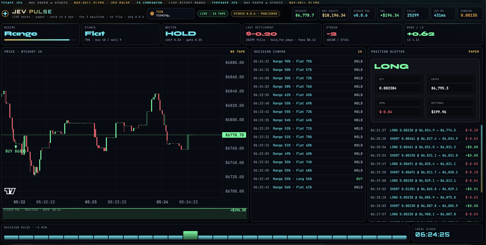
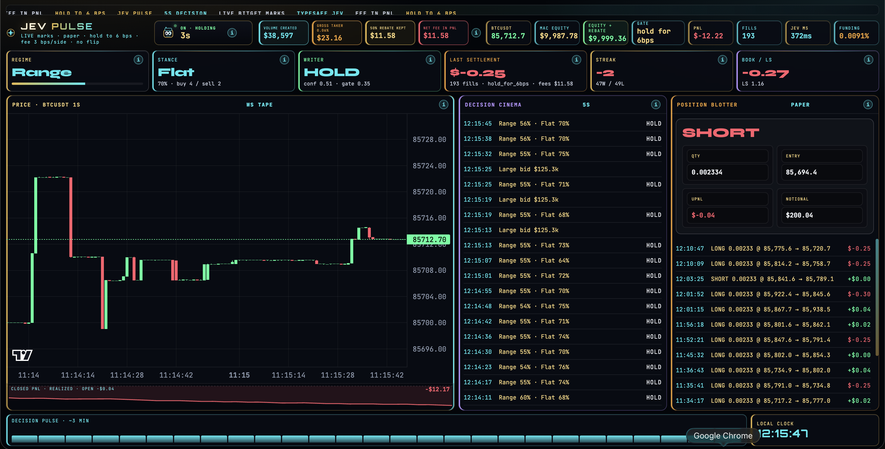

# Jev Pulse

**Bitget AI Base Camp Hackathon S2** · Agentic Trading · **Open Theme (Custom)**

BTCUSDT perpetual paper desk. Live Bitget marks. TypeSafe Jev names a side. The executor decides whether that side is allowed to pay a fee.

Repo: [github.com/CryptoCT01/jev-pulse](https://github.com/CryptoCT01/jev-pulse)

Second independent S2 entry. Not Crossfire.

## Track 2 checklist · Agentic Trading

Ordered for what judges ask for — only what Jev Pulse actually ships:

- [x] **Runnable demo** — local desk on `:8790`, live Bitget public marks
- [x] **LLM as decision-maker** — TypeSafe Jev (`typesafe/jev-1.13`) via OpenRouter Decisions. Choice / Noul / Score only. No prose thesis
- [x] **Event → decision → execution flow** — public tape → Jev → 6 bps fee executor → paper fill or hold
- [x] **Risk control layer** — rebated taker in the book, no same-tick flip, no exit inside 6 bps, one $200 clip
- [x] **Paper trading (not live)** — Mac paper sim, live marks, no Bitget order path
- [x] **Paper trading log** — append-only JSONL in `logs/pre-fee/` and `logs/with-fee/`
- [x] **Compliant X post** — quote-tweet + desk demo [timeline](docs/X-POSTS.md) · https://x.com/CryptoCT01/status/2102053192871661870

## Two frames

### 1. Pure paper. No fee.



First run, before the book was reset. Equity **$10,196.34**. PnL **+$196.34**. **25,299** fills. Those fills are at the mark. No fee. No spread. The green number is an upper bound, not a result.

### 2. The same desk after the fee was put in.



Run after the reset. PnL **−$12.22**. Equity **$9,987.78**. Seed **$10,000**.

What the top row is doing:

| Box | Meaning |
| --- | --- |
| Gross taker 0.06% | Full Bitget USDT-M taker, before the rebate |
| 50% rebate kept | Half of that taker. It is not added on top of Mac equity |
| Net fee in PnL | The half already taken out of the book |
| Equity + rebate | Mac equity plus the rebate. A preview of the credit. Not cash |

On this frame the rebate preview is **$9,999.36**. That is still under the seed. The book is not in profit.

**The second desk is a volume book.** The 6 bps hold plus the 50% taker rebate keep the sleeve near level — Mac equity **$9,987.78**, equity + rebate **$9,999.36**, half a dollar off **$10,000**. A winner that exits on the line nets about **$0** after the fee. A loser is about **−$0.24**. The account does not trend. What compounds is notional: about **$38,600** across **193** fills, one **$200** clip at a time. The rebate is what makes that volume possible without digging a hole.

## How the fee was identified

Bitget USDT-M taker is **0.06% per side**. This account has a **50%** maker and taker rebate, so the cash cost is **0.03% per side**. A round trip, open and close, is **6 bps**.

The first paper sim charged nothing. A winning scratch of a few cents looked like edge. Measured on the archived log:

- about 45 hours
- about 25,300 fills
- realized about **+$196** gross
- median hold **6.4 seconds**
- mean closed-leg move **0.27 bps**
- about **2.2%** of legs cleared a 6 bps round trip
- the same book after the rebated taker is about **−$1,800**

The migration was an executor change, not a new model.

1. Charge **3 bps per side** on every new fill. That is the 0.06% taker after the 50% rebate.
2. Show the gross taker beside it, so the 0.06% line is visible and the rebate is the half that was not paid.
3. Do not add the rebate back onto Mac equity. Equity + rebate is a separate preview.
4. One **$200** clip. No add. No same-tick flip. No exit until the mark has moved **6 bps** for or against.
5. Reset the displayed book to a flat **$10,000** so the new rule can be watched on its own. The old realized was not rewritten into that number.

Flat is still the benchmark. Write-up: [docs/why-cost-gate.md](docs/why-cost-gate.md).

## Logs

The logs are split only because GitHub rejects a single file over 100 MB. Concatenate the parts in order. Nothing was dropped.

```bash
cat logs/pre-fee/paper_ticks.part1.jsonl \
    logs/pre-fee/paper_ticks.part2.jsonl \
    logs/pre-fee/paper_ticks.part3.jsonl \
    > paper_ticks_pre_fee.jsonl

cat logs/with-fee/paper_ticks.part1.jsonl \
    logs/with-fee/paper_ticks.part2.jsonl \
    > paper_ticks_with_fee.jsonl
```

| Path | What it is |
| --- | --- |
| `logs/pre-fee/paper_ticks.part1.jsonl` | First paper run, part 1 |
| `logs/pre-fee/paper_ticks.part2.jsonl` | First paper run, part 2 |
| `logs/pre-fee/paper_ticks.part3.jsonl` | First paper run, part 3 |
| `logs/pre-fee/account.json` | Account snapshot at the reset |
| `logs/with-fee/paper_ticks.part1.jsonl` | Fee run, part 1 |
| `logs/with-fee/paper_ticks.part2.jsonl` | Fee run, part 2 |
| `logs/with-fee/decisions.jsonl` | One decision per tick: action, gate, side, latency |
| `logs/with-fee/trades.jsonl` | Closed paper legs from that run |
| `logs/with-fee/account.json` | Account snapshot from that run |

Each tick is one JSON object per line: state, Jev's answers, the action the executor actually took, and the paper account after the fill or the hold.

The 78 MB parts will not preview in the GitHub file UI. Clone or download raw.

## Run

```bash
cd path/to/jev-pulse
python3 -m pip install websockets
cp .env.example .env          # OpenRouter key only if you want Jev ticks
python3 scripts/dash_server.py
# Desk: http://127.0.0.1:8790/
```

The desk is paper. It does not send orders to Bitget. Public marks need no key. The companion (`scripts/run_companion_loop.sh`) needs `OPENROUTER_API_KEY` in `.env`. Without it the desk still serves live marks and the committed paper log.

A fresh clone starts an empty book unless you point the desk at `logs/with-fee/` — the screenshots are the two frames above.

## Architecture

| Path | Role |
| --- | --- |
| `dash/index.html` | Desk. Served as-is |
| `scripts/dash_server.py` | Threading HTTP on **8790** |
| `scripts/paper_sim.py` | Fee, 6 bps hold, $200 clip |
| `scripts/jev_gate.py` | TypeSafe Jev (OpenRouter Decisions) |
| `scripts/paper_tick.py` | One decision cycle |
| `scripts/ws_public.py` | Live Bitget public marks + 1s candles |
| `.env.example` | Empty keys. Copy to `.env` locally |

### APIs

- `GET /api/health` — process up, `service: jev-pulse`
- `GET /api/state` — last ticks, paper account, live mark overlay

## Security

- No secrets in the repository
- Prefer Bitget Agentic / Demo credentials for any future live sleeve
- Paper only in this path — no live orders, no kill switch to arm
- Do not commit `.env`, `HANDOVER.md`, or `SUBMISSION-DRAFT.md`
- Paper evidence in `logs/pre-fee/` and `logs/with-fee/` is committed on purpose

## Hackathon

- Track: Agentic Trading · Sub-theme: Open Theme (Custom)
- Builder: **cryptoT** ([@CryptoCT01](https://github.com/CryptoCT01))
- Handbook: https://bitget-ai.gitbook.io/bitgetai_hackathons2

## License

MIT License — Copyright (c) 2026 cryptoT / CryptoCTO1
