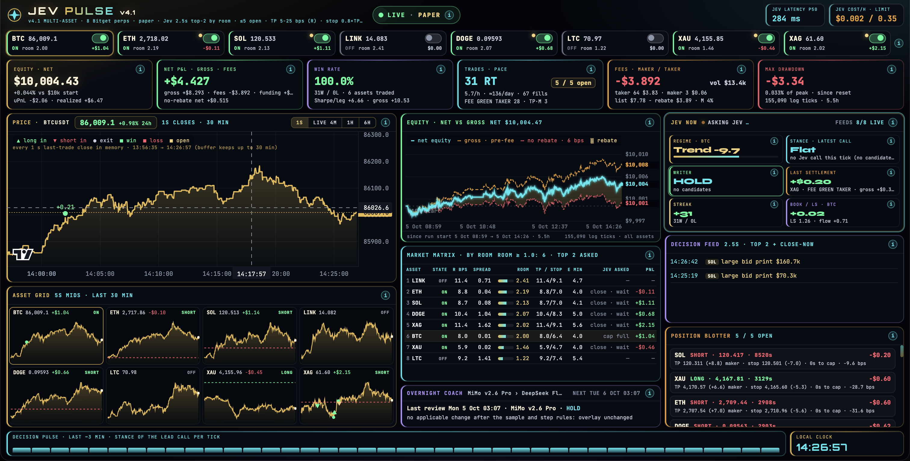
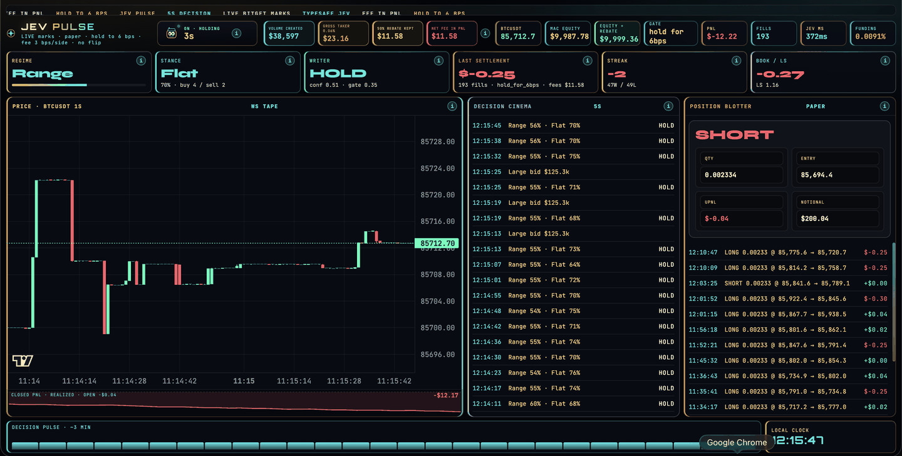
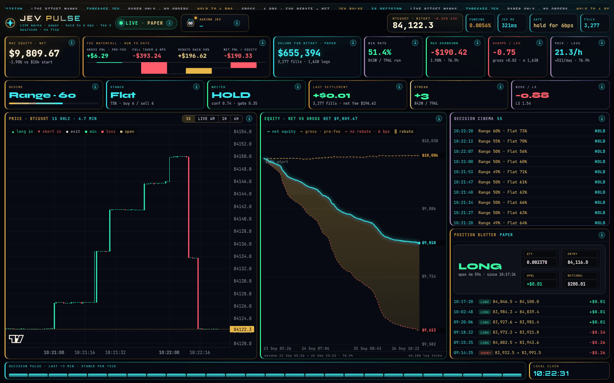
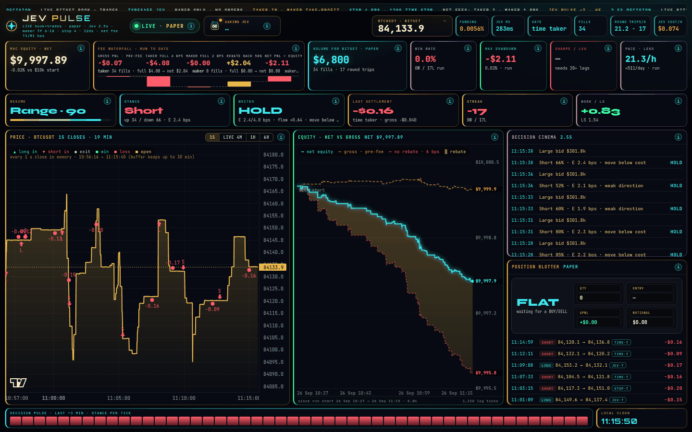

# Jev Pulse

**Bitget AI Base Camp Hackathon S2** · Agentic Trading · **Open Theme (Custom)**

Multi-asset paper desk on live Bitget public USDT-M data. TypeSafe Jev (`typesafe/jev-1.13`, OpenRouter Decisions API) names direction and close-now. A local executor only lets a decision pay a fee when the numbers say it can.

**Paper only. No order is ever sent to Bitget.**

Repo: [github.com/CryptoCT01/jev-pulse](https://github.com/CryptoCT01/jev-pulse)

Second independent S2 entry. Not Crossfire.

---

## Latest: v4.1 final settings (5 Oct 2026)

Live paper desk after the morning experiment loop. Reset to **$10,000** at **~08:59 BST**; by **~14:25 BST** equity was **~$10,004.45**, **31W / 0L**, fees **~$3.89**, max DD **~−$3.34**.



### Current universe

`BTCUSDT` · `ETHUSDT` · `SOLUSDT` · `LINKUSDT` · `DOGEUSDT` · `LTCUSDT` · `XAUUSDT` · `XAGUSDT`

(BNB and XRP out on 5 Oct; SUI out earlier.)

### Current exits (what matters)

| Param | Live value | Notes |
| --- | --- | --- |
| `min_take_usd` | **0.22** | Dollar take-profit floor |
| `hard_stop_usd` | **1.15** | Hard dollar stop |
| `be_trigger_bps` | **10** | Break-even stop: once a trade has been up 10 bps, close it if it falls back to $0 net after fees (7 Oct) |
| `quiet_max_bps` | **8** | Skip markets that are too quiet to clear costs |
| `no_scratch_exits` | **true** | Time soft exit **OFF** |
| `exit_when_net_green` | **true** | Exit when net green after fees |
| Cadence / sizing | 2.5 s · top-2 by room · max 5 open · $200 clip | Unchanged |

Full live file: [`scripts/hf_params.json`](scripts/hf_params.json). Strategy design: [`STRATEGY-v4.md`](STRATEGY-v4.md), [`STRATEGY-v4.1.md`](STRATEGY-v4.1.md). Dated experiments: [`docs/TIMELINE.md`](docs/TIMELINE.md).

---

## What we tried / final choice

Honest short version (full numbers in the [timeline](docs/TIMELINE.md)):

1. **Early multi-asset run** — high WR (~74%), ~1,381 RT, but fees ~$159 → equity ~$9,836. Small targets cannot clear cost. SUI was worst.
2. **2 Oct** — TP $0.28 / stop $1.0, reset; SUI → BNB.
3. **2–5 Oct** — BNB and XRP worst; **5 Oct ~05:00** swap BNB+XRP → LTC+LINK, TP $0.19 / stop $1.25, reset.
4. **Morning research** — time soft exit + TP $0.05 → **worse** (93 RT, 28W/65L, ~−$14).
5. **Revert TP to $0.20, keep time exit** — **still worse** (104 RT, 25W/79L).
6. **User: time makes it worse** → restore **`no_scratch_exits`** (time exit OFF), TP **$0.20**, SL **$1.25**, reset **08:59 BST** → **this green run** (final so far).

**5 Oct choice:** dollar TP $0.20 + hard stop $1.25 + **no time soft exit**.
7. **6 Oct 22:15** — TP $0.22 / stop $1.15 + quiet-market skip, reset. 137 RT, 107W/30L, −$9.33 by 7 Oct 18:12.
8. **7 Oct ~18:15** — **LINK off** (it lost $9.08) + **break-even stop** (10 of 29 losers had been up 10–16 bps), reset to $10,000 → **current run**.

---

## Track 2 checklist · Agentic Trading

Only what Jev Pulse actually ships:

- [x] **Runnable demo**: local desk on `:8790`, live Bitget public data
- [x] **LLM as decision-maker**: TypeSafe Jev (`typesafe/jev-1.13`) via OpenRouter Decisions. Typed answers only (choice, noul, score): direction, expected move, risk stress, close-now. No prose thesis
- [x] **Event → decision → execution flow**: Bitget public book and trade stream → features every 2.5 s → Jev → cost and flow gate → paper fill or hold
- [x] **Risk control layer**: $200 clip, flat-only entries, no same-tick flip, entry only above cost, dollar hard stop, room / spread / stale-book checks, same-side cooldown, max 5 open
- [x] **Paper trading (not live)**: honest paper fills on live data, no Bitget order path
- [x] **Paper trading log**: append-only JSONL. Run-1 evidence in `logs/pre-fee/` and `logs/with-fee/`; v4 archive in `logs/v4-multi/`; live run writes locally under `logs/`
- [x] **Compliant X post**: quote-tweet + desk demo [timeline](docs/X-POSTS.md) · https://x.com/CryptoCT01/status/2102053192871661870

---

## How the v4 desk trades

| Step | Rule |
| --- | --- |
| Data | Bitget public WebSocket `books15`, `trade`, `ticker` for the 8-asset universe |
| Decision | Jev every 2.5 s. Close-now on open positions first, then top-2 flat candidates by room |
| Entry | Taker, one $200 clip. Needs P(side) ≥ 0.60, expected move ≥ cost floor, room ≥ 1.0, flow agreement |
| Take-profit | Maker band clamp(R, 5, 25) bps **and** dollar floor `min_take_usd` 0.22 when `no_scratch_exits` |
| Stop | Bps band clamp(0.8×TP, 4, 20) **and** dollar `hard_stop_usd` 1.15, plus a break-even stop after +10 bps (`be_trigger_bps`) |
| Time soft exit | **OFF** (`no_scratch_exits: true`) — tested; made the book worse |
| Net-green exit | `exit_when_net_green: true` |

Paper fills are deliberately strict: taker at the live touch, maker only when a public trade prints *through* the limit.

| Fee per fill | Full | After 50% rebate |
| --- | --- | --- |
| Taker | 6 bps | 3 bps |
| Maker | 2 bps | 1 bps |

---

## Dashboard timeline (earlier builds)

Each screenshot is real paper data. Full experiment write-up: [docs/TIMELINE.md](docs/TIMELINE.md).

### 1. v1 · original desk (run 1)



### 2. v2 · fee waterfall (26 Sep 2026)



### 3. v3 · HF desk (26 Sep 2026)



### 4. v4.1 · current final book (5 Oct 2026)


---

## Why the strategy changed (v1 → v3 → v4)

### v1 fee problem

The original single-asset desk asked Jev every few seconds, traded one $200 clip, and held until a 6 bps move. Run 1 (23–26 Sep 2026): **−$190.35 net** on ~$655k volume. Before fees **+$6.03**; fees **$196.38**. Replay of 66,960 variants found **no profitable out-of-sample** rule. Jev's edge was real but tiny (~0.2 bps/RT vs 6 bps cost).

### v3

Cost-aware HF on BTC only: enter only when expected move clears fees, maker TPs, Jev close-now. Still too quiet on BTC alone when 5-minute range ≈ cost.

### v4 / v4.1

Same engine, **8 perps**, trade only names with room above cost. v4.1: 5 open slots, $0.35/h Jev budget, tidier desk. Dollar exits (`min_take_usd` / `hard_stop_usd`) and **no_scratch** were tuned on 2–5 Oct — see [docs/TIMELINE.md](docs/TIMELINE.md).

Older fee write-up: [docs/why-cost-gate.md](docs/why-cost-gate.md). Replay study: [research/replay/](research/replay/).

---

## Run

```bash
cd path/to/jev-pulse
python3 -m venv .venv && .venv/bin/pip install websockets
cp .env.example .env                      # add OPENROUTER_API_KEY for Jev

.venv/bin/python scripts/dash_server.py   # desk: http://127.0.0.1:8790/
./scripts/run_companion_loop.sh           # engine, supervised; needs OPENROUTER_API_KEY
# or start desk, keep-alive and engine together:
./start.sh
```

The desk is paper. It does not send orders to Bitget. Public data needs no Bitget key. Without an OpenRouter key the desk still serves live marks and charts, but the engine will not start. `HF_MOCK_JEV=1` runs a mock for plumbing tests. `HF_OUT_DIR=<dir>` sends engine output to another folder for shadow runs.

## Tests

```bash
.venv/bin/pip install pytest
.venv/bin/python -m pytest tests/ -q
```

## Architecture

| Path | Role |
| --- | --- |
| `dash/index.html` | Desk UI |
| `scripts/dash_server.py` | Threading HTTP on **8790** |
| `scripts/hf_engine.py` | Multi-asset engine: 2.5 s decisions, gate, exits |
| `scripts/hf_feed.py` | Bitget public WebSocket → features |
| `scripts/hf_jev.py` | TypeSafe Jev client (OpenRouter Decisions) |
| `scripts/hf_sim.py` | Paper fills and fees |
| `scripts/hf_params.json` | **Live parameters** (synced from the running desk) |
| `scripts/run_companion_loop.sh` | Supervises the engine |
| `docs/TIMELINE.md` | Experiment timeline + final config |
| `docs/screenshots/` | Desk screenshots including 5 Oct green run |
| `STRATEGY-v4.md` / `STRATEGY-v4.1.md` | Strategy design |
| `logs/pre-fee/`, `logs/with-fee/`, `logs/v4-multi/` | Committed paper evidence |
| `.env.example` | Empty keys. Copy to `.env` locally |

### APIs

- `GET /api/health`: process up, `service: jev-pulse`
- `GET /api/state`: last ticks, account, fee split, live mark overlay
- `GET /api/history`: equity curve, trade markers, stats
- `GET /api/candles`: 1 s candles (`?since=<ms>` for deltas)
- `GET /api/pricehist?range=1h|6h`: Bitget public 1-minute kline closes merged with live 1 s closes

## Logs

Committed evidence. Large tick files are split because GitHub rejects files over 100 MB.

| Path | What it is |
| --- | --- |
| `logs/pre-fee/` | First paper run (no fee) |
| `logs/with-fee/` | Run 1 fee-aware book |
| `logs/v4-multi/` | v4 multi-asset archive before a $10k reset |
| [`logs/run-2026-10-05-final/`](logs/run-2026-10-05-final/) | **5 Oct 2026 v4.1 green paper run** — scrubbed trips / fills / decisions + account snapshot for Agentic S2 judges |

Live v4 writes `logs/paper_ticks.jsonl`, `logs/paper_fills.jsonl`, `logs/paper_decisions.jsonl` locally while it runs (gitignored). Raw evidence for today's green run is committed under `logs/run-2026-10-05-final/`.

## Security

- No secrets in the repository
- Prefer Bitget Agentic / Demo credentials for any future live sleeve
- Paper only in this path: no live orders, no kill switch to arm
- Do not commit `.env`, `HANDOVER.md`, `SUBMISSION.md` or `SUBMISSION-DRAFT.md`
- Run evidence in `logs/pre-fee/`, `logs/with-fee/`, `logs/v4-multi/`, and `logs/run-2026-10-05-final/` is committed on purpose

## Hackathon

- Track: Agentic Trading · Sub-theme: Open Theme (Custom)
- Builder: **cryptoT** ([@CryptoCT01](https://github.com/CryptoCT01))
- Handbook: https://bitget-ai.gitbook.io/bitgetai_hackathons2

## License

MIT License — Copyright (c) 2026 cryptoT / CryptoCT01
